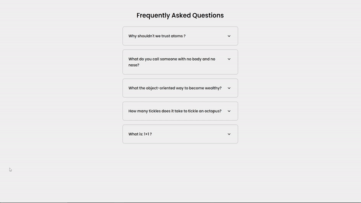

# FAQ  :thought_balloon:

* Função de aparecer e desaparecer o texto,
* Um botão faz aparecer e desaparecer o conteúdo usando toggle
* Veja o GIF abaixo.

** Captura em uma constante todos os elementos que possuim a classe faq-toggle.Depois, para cada toggle capturado, ele aciona seu pai por meio do comando parentNode e adiciona a classe active caso ela não esteja presente.

  

