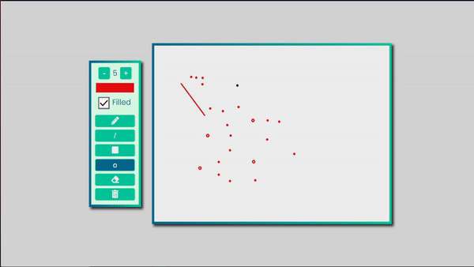

# Paint :pencil2:

* Cria uma tela canvas para desenhar
* Tem a opção de fazer circulos
* Tem a opção de fazer linhas
* Tem a opção de apagar com a borracha
* Tem a opção de começar novamente.
* Tem a opção de preencher o circulo com fill
* Veja o GIF abaixo.

  

