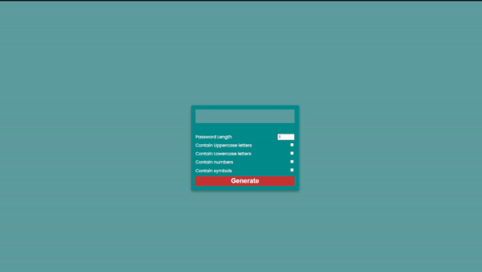

# Password generator :closed_lock_with_key:

* Cria um gerador de senha
* Pode escolher os tipos de caractere que a criação será feita
* Mostra um botão de copiar ao passar o mouse na senha.
* Veja o GIF abaixo.

  

